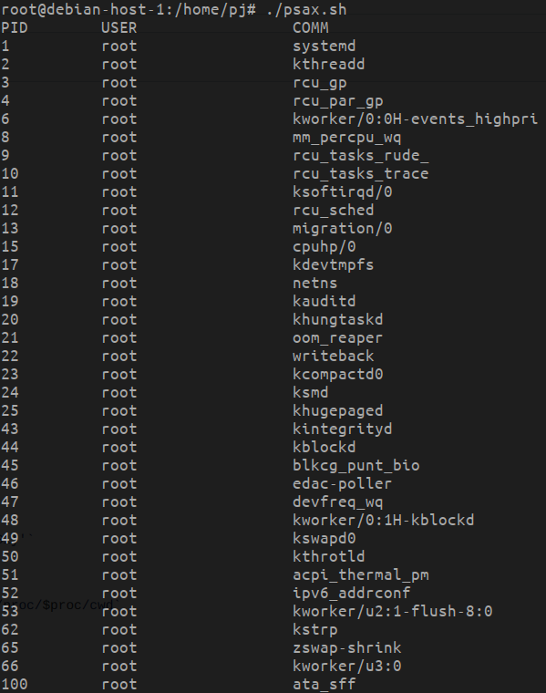

Добрый день, сегодня пробуем получить информацию о процессах из псевдофайлов в /proc
Пишем скрипт psaux.sh перебирающий процессы и берущий нужную информацию, результат на скриншоте

немного похоже на ps )
